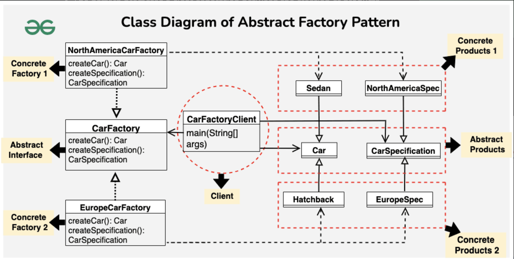

*Imagine you’re managing a global car manufacturing company. You want to design a system to **create cars** with **specific configurations** for **different regions**, such as North America and Europe. Each region may have unique requirements and regulations, and you want to ensure that cars produced for each region meet those standards.*

The **Abstract Factory Pattern** is a way of organizing how you create groups of things (products) that are related to each other. It provides a set of rules or instructions that let you **create different types of things without knowing exactly what those things are**. This helps you keep everything organized and lets you switch between different types easily

- Abstract Factory pattern is almost similar to [Factory Pattern](https://www.geeksforgeeks.org/design-patterns-set-2-factory-method/) and is considered as another layer of abstraction over factory pattern.
- at runtime, the abstract factory is coupled with any desired concrete factory which can create objects of the desired type

```java
// Abstract Factory Interface
interface CarFactory {
    Car createCar();
    CarSpecification createSpecification();
}

// Concrete Factory for North America Cars
class NorthAmericaCarFactory implements CarFactory {
    public Car createCar() {
        return new Sedan();
    }

    public CarSpecification createSpecification() {
        return new NorthAmericaSpecification();
    }
}

// Concrete Factory for Europe Cars
class EuropeCarFactory implements CarFactory {
    public Car createCar() {
        return new Hatchback();
    }

    public CarSpecification createSpecification() {
        return new EuropeSpecification();
    }
}

// Abstract Product Interface for Cars
interface Car {
    void assemble();
}

// Abstract Product Interface for Car Specifications
interface CarSpecification {
    void display();
}

// Concrete Product for Sedan Car
class Sedan implements Car {
    public void assemble() {
        System.out.println("Assembling Sedan car.");
    }
}

// Concrete Product for Hatchback Car
class Hatchback implements Car {
    public void assemble() {
        System.out.println("Assembling Hatchback car.");
    }
}

// Concrete Product for North America Car Specification
class NorthAmericaSpecification implements CarSpecification {
    public void display() {
        System.out.println("North America Car Specification: Safety features compliant with local regulations.");
    }
}

// Concrete Product for Europe Car Specification
class EuropeSpecification implements CarSpecification {
    public void display() {
        System.out.println("Europe Car Specification: Fuel efficiency and emissions compliant with EU standards.");
    }
}


// Client Code
public class CarFactoryClient {
    public static void main(String[] args) {
        // Creating cars for North America
        CarFactory northAmericaFactory = new NorthAmericaCarFactory();
        Car northAmericaCar = northAmericaFactory.createCar();
        CarSpecification northAmericaSpec = northAmericaFactory.createSpecification();

        northAmericaCar.assemble();
        northAmericaSpec.display();

        // Creating cars for Europe
        CarFactory europeFactory = new EuropeCarFactory();
        Car europeCar = europeFactory.createCar();
        CarSpecification europeSpec = europeFactory.createSpecification();

        europeCar.assemble();
        europeSpec.display();
    }
}
```

**Advantages**

- ****Isolation of concrete classes:****
  
  - Because a factory encapsulates the responsibility and the process of creating product objects, it isolates clients from implementation classes.
  
  - Clients manipulate instances through their abstract interfaces. Product class names are isolated in the implementation of the concrete factory; they do not appear in client code.

- ****Promoting consistency among products:****
  
  - When product objects in a family are designed to work together, it’s important that an application use objects from only one family at a time. AbstractFactory makes this easy to enforce.

**Disadvantages**

- ****Complexity:****
  
  - Abstract Factory can introduce additional complexity to the codebase.
  - Having multiple factories and abstract product interfaces may be overkill for simpler projects.

- ****Rigidity with New Product Types:****
  
  - Adding new product types (classes) to the system can be challenging.
  - You might need to modify not just the concrete factories but also the abstract factory interface, potentially impacting existing code.


